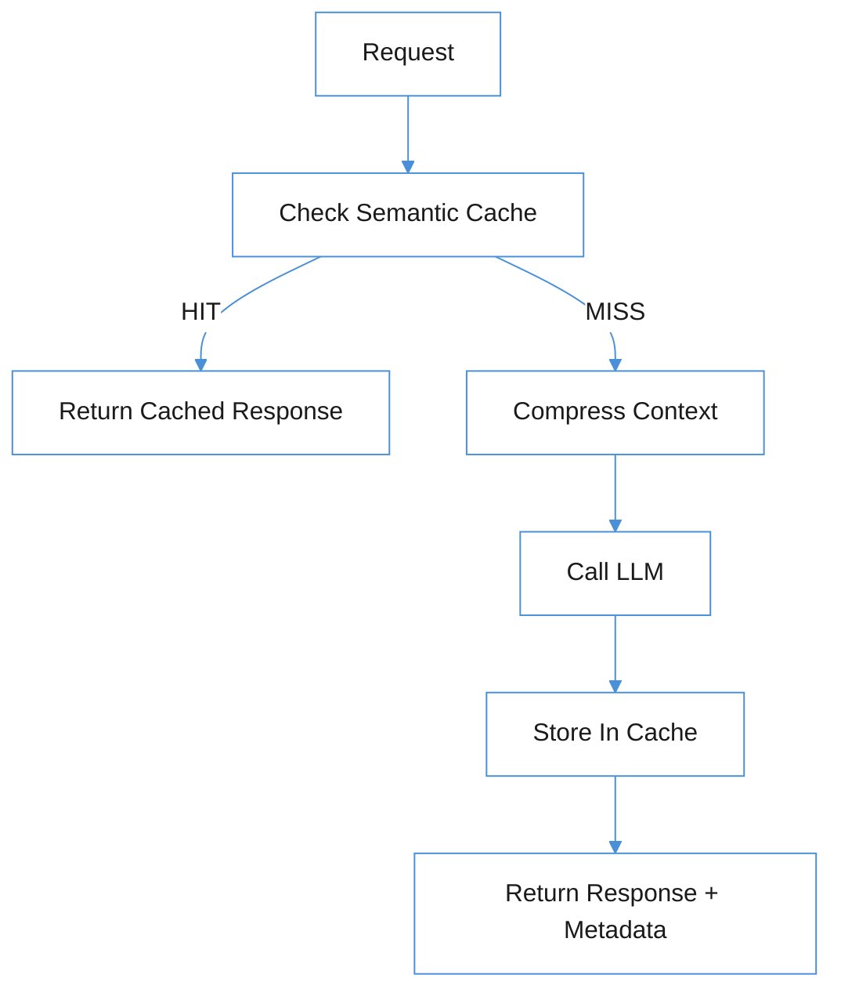

# The Hidden Costs of LLM Inference: And How to Fix Them in Python

*Four problems that quietly drain your API budget, and the middleware layer I built to solve them.*

---

Every LLM API call has a price tag. For a toy project, you don't notice. At scale, or even during serious development, you start to: redundant calls for semantically identical questions, conversations ballooning past context limits, no guardrails on runaway spend, and zero visibility into what your cache is actually doing for you.

I built [llm-inference-toolkit](https://github.com/Vedanshu7/llm-inference-toolkit) to address all four. It's a middleware layer that sits in front of any LLM provider (via litellm) and adds a semantic response cache, a context compression engine, per-conversation cost guardrails, and an observability API. This post walks through each problem, how the toolkit solves it, and what the real numbers look like.

---

## 1. Redundant API Calls: You're Paying for the Same Answer Twice

The naive approach to LLM caching is exact-string matching. Cache the prompt, return the cached response if the next prompt is identical. This sounds reasonable until you realize that users don't type the same thing twice; they type semantically equivalent things:

```
"What is the capital of France?"
"What's the capital city of France?"
"Can you tell me France's capital?"
"What is the main city of France?"
```

An exact-match cache returns nothing for three of these. An API call goes out, you pay for tokens, and you get back an answer that was already in your cache, just under a slightly different key.

The fix is semantic caching. Instead of matching strings, embed each prompt into a vector and compare incoming prompts against stored ones using cosine similarity. If the similarity score exceeds a threshold, return the cached response.

```python
async def get(self, prompt: str) -> CacheHit | None:
    query_embedding = await self._embed(prompt)
    best_entry, best_score = self._find_best_match(query_embedding, entries)
    if best_score >= settings.cache_similarity_threshold:
        self._cache_hits += 1
        return CacheHit(
            entry=best_entry,
            matched_prompt=best_entry.prompt,
            similarity_score=round(best_score, 6),
            cache_age_seconds=round(age, 2),
        )
    return None
```

The threshold is the lever. At `0.92` (the default), "What is the capital of France?" matches "What's the capital city of France?" but not "How do I reverse a list in Python?", which is different enough that you want a fresh call. Tune it lower to be more aggressive, higher to be more conservative.

From the demo with five semantically varied questions:

```
[1] What is the capital of France?     -> MISS (213ms) - cached
[2] What's the capital city of France? -> HIT  (8ms)   - served from cache
[3] Can you tell me France's capital?  -> HIT  (7ms)   - served from cache
[4] How do I reverse a list in Python? -> MISS (198ms) - cached
[5] What is the main city of France?   -> HIT  (9ms)   - served from cache

Total questions : 5
Cache hits      : 3
Hit rate        : 60%
API calls made  : 2
API calls saved : 3
```

60% hit rate on a small sample. At production scale, with users asking overlapping questions in a support or documentation chatbot, this number climbs fast, and every hit is a call you didn't pay for.

> **Pro tip:** Don't set the threshold too low. At `0.75`, you risk returning a cached response for a question that's merely in the same topic area, not semantically equivalent. Run your real query distribution through the cache before tuning down.

---

## 2. Context Windows Are a Lie at Conversation Scale

Every model has a context window. Claude Haiku's is 200K tokens. GPT-4o's is 128K. These numbers feel enormous until you have a chatbot that's been running for an hour, appending every user message and assistant response to the history, and you're at turn 40 with a full stack trace in the conversation.

The naive solutions (truncate old messages or throw an error) are both wrong. Truncation loses context the model needs. Errors break the user experience. The right answer is automatic summarisation.

The `ContextCompressor` monitors the running token count after each turn. When it crosses `compression_threshold x context_window` (default: 80%), it:

1. Separates the system prompt (always preserved) from conversational turns
2. Keeps the two most recent exchanges intact
3. Summarises everything older using a cheap fast model (Claude Haiku by default)
4. Replaces the compressed turns with a single summary message

```python
async def compress(self, messages: list[Message], model: str) -> list[Message]:
    current_tokens = litellm.token_counter(model=model, messages=messages)
    context_limit = self._get_context_limit(model)
    threshold_tokens = int(context_limit * settings.compression_threshold)
    if current_tokens <= threshold_tokens:
        return messages
    # preserve system prompt and last 2 turns
    system_messages = [m for m in messages if m["role"] == "system"]
    non_system = [m for m in messages if m["role"] != "system"]
    to_compress = non_system[:-2]
    to_keep = non_system[-2:]
    summary = await self._summarise(to_compress, model)
    summary_message = {"role": "user", "content": f"[Summary of earlier conversation]\n{summary}"}
    return system_messages + [summary_message] + to_keep
```

From a real 12-turn conversation run against the toolkit:

```
[Turn 01] Tokens:   32 ->   32
[Turn 02] Tokens:  169 ->  169
[Turn 03] Tokens:  297 ->  297
[Turn 04] Tokens:  431 ->  431
[Turn 05] Tokens:  683 ->  254  <- COMPRESSED  (63% reduction)
[Turn 06] Tokens:  391 ->  391
[Turn 07] Tokens:  531 ->  300  <- COMPRESSED  (43% reduction)
[Turn 08] Tokens:  437 ->  437
[Turn 09] Tokens:  772 ->  293  <- COMPRESSED  (62% reduction)
[Turn 10] Tokens:  428 ->  266  <- COMPRESSED  (38% reduction)
[Turn 11] Tokens:  395 ->  395
[Turn 12] Tokens:  522 ->  522

Final message count : 5    (vs 25 without compression)
Final token count   : 731
```

Compression triggered four times in twelve turns. The final conversation is 5 messages instead of 25, at 731 tokens, a fraction of what it would have been without intervention. Critically, the final turn ("What tech stack have I described so far?") gets a correct and complete answer because the summary preserved the key facts from earlier turns.

> **Pro tip:** The summarisation model matters. A model that's too cheap produces vague summaries that lose important context. The sweet spot is a fast, inexpensive model with strong instruction-following, like Claude Haiku or GPT-4o-mini. Don't use the same model you're compressing for.

---

## 3. Stateful Conversations Without Ballooning Costs

Most LLM API wrappers are stateless. You pass in the full conversation history, you get back a response, done. Managing state (which turns to keep, when to compress, what this conversation has spent so far) becomes application logic that every team reimplements slightly differently.

The `Conversation` class makes it explicit:

```python
# Create a conversation with a $0.10 budget
POST /v1/conversations
{
  "model": "claude-haiku-4-5-20251001",
  "system_prompt": "You are a helpful assistant.",
  "max_cost_usd": 0.10
}

# Send a message - caching and compression happen automatically
POST /v1/conversations/{id}/messages
{"content": "What's the best way to structure a FastAPI app?"}
```

The response tells you everything that happened on this turn:

```json
{
  "response": "For a production FastAPI app, I'd recommend...",
  "cached": false,
  "cache_meta": null,
  "cost_usd": 0.0003,
  "cumulative_cost_usd": 0.0031,
  "compressed": false,
  "token_count": 312
}
```

Every turn goes through the same pipeline: check the semantic cache first, compress context if needed, call the LLM, cache the response, track cost. None of this needs to live in your application code.

> **Pro tip:** `cumulative_cost_usd` in the response is your early warning system. Build a frontend indicator off it; users who can see their conversation cost in real time make very different choices about how much they type.

---

## 4. Cost Guardrails: Set a Budget and Mean It

Rate limiting LLM spend is harder than it sounds. You can set a per-minute token limit at the API level, but that doesn't help you cap what a single conversation costs, and it doesn't give you a graceful degradation strategy when you're approaching the limit.

The toolkit's guardrail system works in two stages. The first stage is a soft limit: when cumulative cost reaches `cost_guardrail_threshold x max_cost_usd` (default: 80%), the compressor is invoked aggressively, even if the context window isn't close to full, to reduce token spend on subsequent turns. The second stage is a hard limit: at `max_cost_usd`, the API returns HTTP 402 and raises `BudgetExceededError`.

```python
# In the conversation manager, before every turn:
if self.cumulative_cost_usd >= self.max_cost_usd:
    raise BudgetExceededError(
        f"Budget of ${self.max_cost_usd:.4f} USD exceeded "
        f"(spent ${self.cumulative_cost_usd:.4f} USD)."
    )

if self.max_cost_usd > 0:
    guardrail_threshold = self.cumulative_cost_usd / self.max_cost_usd
    if guardrail_threshold >= settings.cost_guardrail_threshold:
        messages = await self._compressor.compress(messages, self.model)
```

This is the pattern that matters: don't just cut off users when they hit the limit. Warn them early and switch to a cheaper mode of operation first. A conversation that's been compressed is less expensive per turn and may stay within budget for several more turns.

> **Pro tip:** Set `max_cost_usd` per user tier, not per conversation type. Power users can have a higher budget; free-tier users get a tighter ceiling. The `Conversation` object is serialisable; store it in your database and restore it across sessions with `Conversation.to_dict()` / `Conversation.from_dict()`.

---

## 5. Observability: Know What Your Cache Is Actually Doing

A cache with no visibility is a cache you can't tune. The toolkit exposes three analytics endpoints that tell you what's happening inside:

**Cache stats** (`GET /v1/cache/stats`): the basics:

```json
{
  "total_requests": 847,
  "cache_hits": 531,
  "hit_rate": 0.627,
  "total_entries": 94
}
```

**Savings report** (`GET /v1/cache/savings`): the part that matters for ROI conversations:

```json
{
  "total_entries": 94,
  "total_cache_hits": 531,
  "total_cost_of_original_calls_usd": 1.84,
  "estimated_savings_usd": 10.27,
  "avg_cost_per_call_usd": 0.0196
}
```

**Semantic clusters** (`GET /v1/cache/clusters`): the one most people skip, and shouldn't:

```json
[
  {
    "cluster_id": 0,
    "centroid_prompt": "What is the capital of France?",
    "member_count": 4,
    "total_hits": 47,
    "avg_similarity": 0.96
  },
  {
    "cluster_id": 1,
    "centroid_prompt": "How do I handle errors in FastAPI?",
    "member_count": 7,
    "total_hits": 83,
    "avg_similarity": 0.91
  }
]
```

Clusters reveal what your users are actually asking. A cluster with 7 members and 83 hits isn't just a cache efficiency win; it's a signal that you probably need better documentation on that topic, or a dedicated FAQ entry, or a pre-canned answer that you control. The cache is incidentally doing user research for you.

> **Pro tip:** Sort clusters by `total_hits` descending and review the top 10 every sprint. The centroid prompt is a representative question, not necessarily the most common phrasing, but it's close enough to tell you what content gaps you have.

---

## 6. The Architecture That Ties It Together

Every request goes through the same pipeline, whether it's a stateless chat completion or a stateful conversation turn:



The storage layer is pluggable. `InMemoryStore` is fast, zero-config, and appropriate for single-instance deployments or development. `RedisStore` gives you persistence and distributed cache sharing across multiple API server instances. Both implement the same `CacheStore` protocol, so switching is a one-line config change:

```
# .env
REDIS_URL=redis://localhost:6379   # use Redis
REDIS_URL=                         # fall back to in-memory
```

The LLM provider layer goes through litellm, which means you're not locked in. Swap `claude-haiku-4-5-20251001` for `gpt-4o-mini` or `gemini/gemini-1.5-flash` without changing any application code. The caching, compression, and cost tracking work the same regardless of which model you use.

---

## Closing Thoughts

None of the problems here are exotic. Redundant API calls, runaway context windows, and uncapped spend show up in almost every production LLM deployment I've seen. The tools to fix them aren't complicated either; the interesting part is wiring them together so they're invisible to your application code.

The thing that surprised me most building this was the semantic clustering. I added it as an afterthought to make the analytics endpoint more useful. It turned out to be the most interesting output, not because it saves money directly, but because it makes visible something that was always true and previously invisible: your users are asking the same questions over and over, just phrased differently. That's worth knowing.

The full source is at [github.com/Vedanshu7/llm-inference-toolkit](https://github.com/Vedanshu7/llm-inference-toolkit) (MIT licensed, contributions welcome).

---

*The compression numbers in this post came from a real run against Claude Haiku 4.5. The cache analytics are representative of what you'd see at moderate traffic. If you're running this in production and have different numbers, I'd genuinely like to know; open an issue or find me in the comments.*
