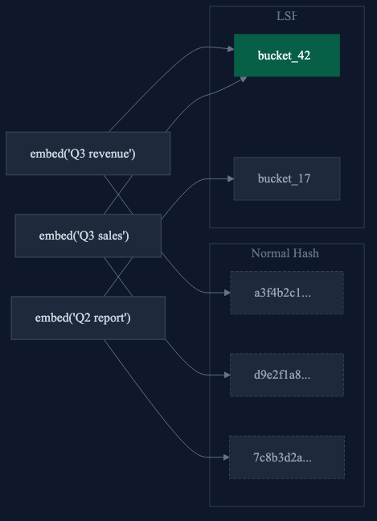
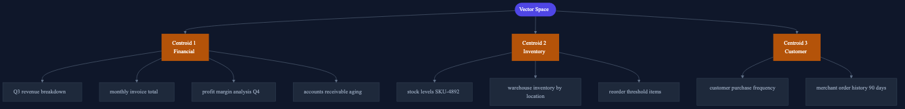
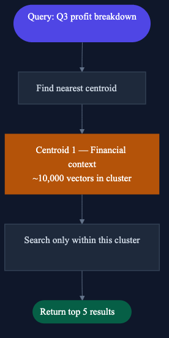
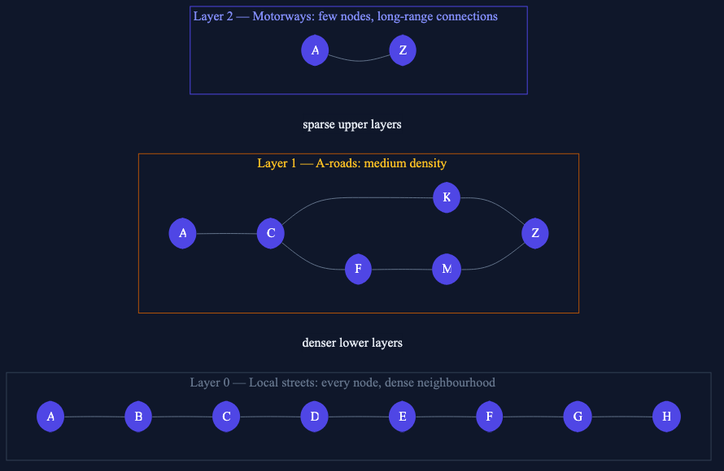
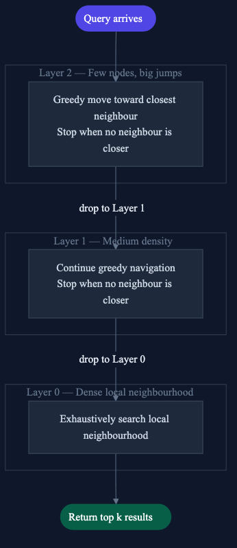
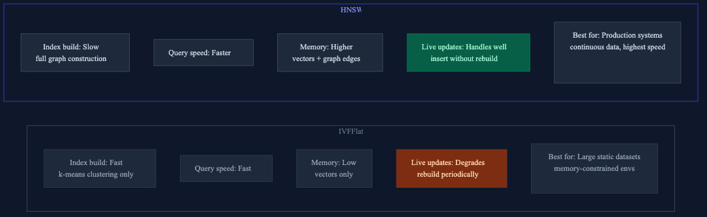
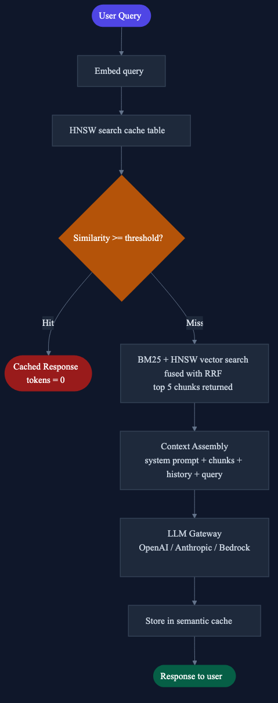

# How Vector Search Actually Works: pgvector, LSH, HNSW, and Semantic Caching Under the Hood

*From brute force failure to sub-100ms retrieval across 10 million vectors, a ground-up explanation of every layer.*


*Photo by [Roman Mager](https://unsplash.com/@roman_lazygeek) on [Unsplash](https://unsplash.com/photos/5mZ_M06Fc9g)*

> **TL;DR** Most RAG tutorials hide the hard part behind one function call. This post opens it up: why brute force search collapses at scale, how LSH introduced the core insight that modern indexes still use, why HNSW replaced it, how hybrid BM25 + vector search covers the blind spots, and how semantic caching makes the most expensive layer (the LLM call) free on repeat queries. Every section includes working code you can drop into a pgvector setup.


## Who This Is For

You have built a RAG system. It works in development. Now you are thinking about production: real query volumes, real latency requirements, real cost pressure from LLM calls. You have heard of HNSW and pgvector but you want to understand what they actually do, not just which flag to set.

This post is for you.


## The Problem Nobody Talks About in RAG Tutorials

Most RAG tutorials show you something like this:

```python
results = vectorstore.similarity_search("What were top products in Q3?", k=5)
```

One line. Clean. Simple. Works great in a notebook with 500 documents.

Then you put it in production with 10 million chunks across 400 tenants, each query needing a response in under 100ms, and that one line becomes the most expensive operation in your entire system.

The question tutorials never answer: **how does the vector store actually find the nearest vector without comparing against every single one?**

This post answers that from first principles, starting with why brute force fails, moving through Locality Sensitive Hashing, then IVFFlat and HNSW, then hybrid search, and ending with semantic caching as the final force multiplier.


## Part 1: Why Brute Force Doesn't Work

Let's start with what vector similarity search actually does at the machine level.

You have a query. You embed it into a 1536-dimensional vector using a model like OpenAI's `text-embedding-3-small`. You want the 5 most similar vectors in your database.

The naive approach (compute cosine similarity against every stored vector, return the top 5):

```python
import numpy as np

def cosine_similarity(a: np.ndarray, b: np.ndarray) -> float:
    return np.dot(a, b) / (np.linalg.norm(a) * np.linalg.norm(b))

def brute_force_search(
    query_vector: np.ndarray,
    all_vectors: list[np.ndarray],
    k: int = 5
) -> list[int]:
    scores = [
        (i, cosine_similarity(query_vector, vec))
        for i, vec in enumerate(all_vectors)
    ]
    scores.sort(key=lambda x: x[1], reverse=True)
    return [i for i, _ in scores[:k]]
```

This is O(n) per query. Here is what that looks like at different scales on a standard CPU:

```
Vectors        Query latency    50K daily queries    Daily compute
───────────────────────────────────────────────────────────────────
10,000         ~1ms             ~8 minutes           manageable
1,000,000      ~100ms           ~83 hours            not viable
10,000,000     ~1,000ms         ~35 days             impossible
```

At 10 million vectors and 50,000 daily queries you are running **500 billion similarity comparisons per day**, each involving 1,536 floating point multiplications.

That is not a latency problem. That is a physics problem.

You need a data structure that makes the search sub-linear, something that lets you skip most of the comparisons without losing the right answers. That is what indexes do, and understanding them starts with a counterintuitive trick from the 1990s.


## Part 2: Locality Sensitive Hashing: The Core Insight

Before modern vector databases existed, the standard solution was Locality Sensitive Hashing (LSH). It is largely superseded now, but understanding it unlocks the intuition behind everything that came after.

### The Insight

Normal hash functions are engineered to avoid collisions; similar inputs should produce different outputs. MD5("apple") and MD5("apples") look nothing alike. That is the point.

LSH flips this deliberately. You design a hash function where **similar inputs produce the same output**:



Important: LSH operates on **embedding vectors**, not raw text. The text is converted to a high-dimensional vector first, and LSH partitions that vector space.

### Random Projection

The most common LSH technique is random projection. Here is the intuition.

Imagine your embedding vectors live in 2D space (real embeddings are 1536-dimensional but the principle is identical). Draw a random line through that space. Every vector falls on either the left or the right side.

```
               LEFT  |  RIGHT
                     |
  "Q3 revenue"  •   |             • "Q2 report"
                     |
  "Q3 sales"    •   |
                     |
```

"Q3 revenue" and "Q3 sales" are semantically similar; they point in similar directions in embedding space and fall on the same side of most random lines. "Q2 report" points in a different direction and falls on the other side.

Each line gives one bit: left = 0, right = 1. Draw 16 random lines and you get a 16-bit hash. Semantically similar vectors tend to get the same hash. Semantically different vectors diverge.

```python
import numpy as np

class RandomProjectionLSH:
    def __init__(self, vector_dim: int = 1536, n_planes: int = 16):
        # random hyperplane normals — fixed after initialization
        # shape: (n_planes, vector_dim)
        self.planes = np.random.randn(n_planes, vector_dim)
        self.buckets: dict[str, list[tuple[np.ndarray, str]]] = {}

    def _hash(self, vector: np.ndarray) -> str:
        # dot product with each plane normal
        # positive = same side as normal = bit 1
        # negative = opposite side = bit 0
        projections = np.dot(self.planes, vector)    # (n_planes,)
        bits = (projections > 0).astype(int)
        return "".join(map(str, bits))               # e.g. "1010011010110101"

    def store(self, vector: np.ndarray, payload: str) -> None:
        key = self._hash(vector)
        self.buckets.setdefault(key, []).append((vector, payload))

    def lookup(self, query_vector: np.ndarray, threshold: float = 0.92) -> str | None:
        key = self._hash(query_vector)
        candidates = self.buckets.get(key, [])

        # compare only against vectors in the same bucket
        for stored_vector, payload in candidates:
            sim = self._cosine(query_vector, stored_vector)
            if sim >= threshold:
                return payload  # hit

        return None  # miss

    @staticmethod
    def _cosine(a: np.ndarray, b: np.ndarray) -> float:
        return float(np.dot(a, b) / (np.linalg.norm(a) * np.linalg.norm(b)))
```

### The Speed Gain

With 16 planes you have 2^16 = 65,536 possible buckets. Across 1 million vectors distributed roughly uniformly:

```
1,000,000 vectors / 65,536 buckets ≈ 15 vectors per bucket

Without LSH:  1,000,000 comparisons per query
With LSH:            15 comparisons per query
```

### The Limitation

LSH makes a hard tradeoff: two similar vectors can land in different buckets if they happen to fall on opposite sides of one random plane. You miss a cache hit that should have been found. This is a **false negative**.

You control this with two levers:
- **More planes** → finer buckets → fewer misses → slower
- **Fewer planes** → coarser buckets → more misses → faster

In practice you run multiple independent LSH tables and union their results; this reduces false negatives at the cost of more memory. It works, but it is operationally complex.

LSH was the dominant approach until roughly 2016. Then graph-based methods arrived with a fundamentally better answer to the same problem; they achieve higher recall at the same speed without the false-negative tradeoff that LSH forces you to manage manually.


## Part 3: IVFFlat: Clustering for Search

IVFFlat (Inverted File with Flat storage) is one of the two primary indexes in pgvector. Instead of hashing, it partitions the vector space into clusters.

### Build Phase

Run k-means clustering over all your vectors. Each vector gets assigned to its nearest centroid:



### Query Phase

Find the nearest centroid(s) to your query, then search only within those clusters:



Instead of searching 1 million vectors, you search 10,000.

### IVFFlat in pgvector

```sql
-- enable pgvector extension (once per database)
CREATE EXTENSION IF NOT EXISTS vector;

-- your table
CREATE TABLE document_chunks (
    id          UUID PRIMARY KEY DEFAULT gen_random_uuid(),
    tenant_id   UUID NOT NULL,
    content     TEXT,
    embedding   vector(1536)
);

-- create IVFFlat index
-- lists = number of centroids
-- rule of thumb: sqrt(row_count), so 100 for 10K rows, 1000 for 1M rows
CREATE INDEX ON document_chunks
USING ivfflat (embedding vector_cosine_ops)
WITH (lists = 100);
```

```python
import psycopg2
from pgvector.psycopg2 import register_vector

def ivfflat_search(
    query_embedding: list[float],
    tenant_id: str,
    k: int = 5,
    n_probes: int = 10
) -> list[dict]:
    with psycopg2.connect(conn_string) as conn:
        register_vector(conn)  # register pgvector type adapter
        with conn.cursor() as cur:
            # nprobes = how many clusters to search
            # higher = better recall, slower query
            cur.execute("SET ivfflat.probes = %s", (n_probes,))
            cur.execute("""
                SELECT content,
                       1 - (embedding <=> %s::vector) AS similarity
                FROM document_chunks
                WHERE tenant_id = %s
                ORDER BY embedding <=> %s::vector
                LIMIT %s
            """, (query_embedding, tenant_id, query_embedding, k))

            return [
                {"content": row[0], "similarity": float(row[1])}
                for row in cur.fetchall()
            ]
```

### The nprobes Knob

`nprobes` is IVFFlat's recall vs speed lever:

```
nprobes = 1     → 1 cluster searched   → fastest, lowest recall
nprobes = 10    → 10 clusters searched → balanced (start here)
nprobes = lists → all clusters         → same as brute force
```

Start with `nprobes = sqrt(lists)` and tune from there based on your recall requirements.

### IVFFlat's Limitation

The clusters are fixed at index creation time. Add new vectors and they are assigned to the nearest existing centroid, but if those vectors represent a new semantic region not well-covered by existing centroids, retrieval quality degrades silently over time. You need to periodically rebuild the index as your data grows.

For datasets that change frequently, you want HNSW.


## Part 4: HNSW: Graph-Based Navigation

HNSW (Hierarchical Navigable Small World) is the current state-of-the-art for approximate nearest neighbour search and the default index type in pgvector. It solves IVFFlat's staleness problem and achieves higher recall at similar query speeds.

### The Structure

HNSW builds a layered graph. Every vector is a node. Each node has connections to its nearest neighbours. The layers work like a road network:



Not every node makes it to the upper layers. The top layers are sparse, giving the graph its long-range navigation properties.

### How Search Works



The key property is "small world": because of how the graph is constructed, any two nodes are reachable in a small number of hops. The upper layers let you cross large semantic distances quickly before the lower layer gives you fine-grained precision.

### HNSW in pgvector

```sql
-- create HNSW index
-- m = connections per node per layer (default 16)
-- ef_construction = candidate list size during build (default 64)
CREATE INDEX ON document_chunks
USING hnsw (embedding vector_cosine_ops)
WITH (m = 16, ef_construction = 64);
```

```python
def hnsw_search(
    query_embedding: list[float],
    tenant_id: str,
    k: int = 5,
    ef_search: int = 40
) -> list[dict]:
    with psycopg2.connect(conn_string) as conn:
        register_vector(conn)
        with conn.cursor() as cur:
            # ef_search = candidate list size during query
            # tunable without rebuilding the index
            cur.execute("SET hnsw.ef_search = %s", (ef_search,))
            cur.execute("""
                SELECT content,
                       1 - (embedding <=> %s::vector) AS similarity
                FROM document_chunks
                WHERE tenant_id = %s
                ORDER BY embedding <=> %s::vector
                LIMIT %s
            """, (query_embedding, tenant_id, query_embedding, k))

            return [
                {"content": row[0], "similarity": float(row[1])}
                for row in cur.fetchall()
            ]
```

### Tuning HNSW

**`m`**: connections per node per layer. Controls graph density.

```
m = 8    low memory, lower recall   → small datasets, memory-constrained
m = 16   balanced                   → default, works for most cases
m = 64   high memory, high recall   → maximum accuracy requirements
```

**`ef_construction`**: candidate list size during index build. Higher quality graph, slower build. Set once at index creation.

```
ef_construction = 32    fast build, lower graph quality
ef_construction = 64    balanced (default)
ef_construction = 256   slow build, highest graph quality
```

**`ef_search`**: candidate list size at query time. **This is the knob you tune in production**; it does not require rebuilding the index.

```
ef_search = 10     fast, misses some results
ef_search = 40     balanced starting point
ef_search = 200    near-perfect recall, slower
```


## Part 5: IVFFlat vs HNSW



**When to use IVFFlat**: your dataset is large and mostly static, you rebuild the index on a schedule, and memory is a hard constraint.

**When to use HNSW**: you need the fastest queries, data arrives continuously (new tenants, new documents), and you are running on pgvector in production. This is the default choice for good reason.


## Part 6: Hybrid Search: Closing the Blind Spot

Pure vector search has one significant weakness: it finds semantically similar content, but it can miss exact matches.

```
Query: "order ORD-48291 shipping status"

Vector search:  finds chunks about order status generally
                misses the specific order ORD-48291 because a
                product ID has no semantic neighbourhood

BM25 search:    finds the exact chunk containing "ORD-48291"
                because it does exact keyword matching
```

The solution is to run both retrieval methods in parallel and fuse their results. This is **hybrid search**.

### BM25 Refresher

BM25 is the algorithm behind most traditional search engines. It scores documents on:

- **Term frequency**: how often the search term appears in the document
- **Inverse document frequency**: how rare the term is across all documents
- **Length normalization**: shorter documents are not penalized for not repeating terms

It does not understand meaning. "Invoice payment failure" and "failed to collect money" are unrelated to BM25. That is why you need both.

### Reciprocal Rank Fusion

Combining raw BM25 scores and cosine similarity scores is tricky; they are on completely different scales. The cleaner approach is Reciprocal Rank Fusion (RRF), which combines **ranks** rather than scores:

```
RRF score = sum over all retrievers of: 1 / (rank_in_that_retriever + k)
k = 60 (standard constant, reduces the impact of extreme rank differences)
```

```python
from dataclasses import dataclass

@dataclass
class RetrievalResult:
    id: str
    content: str

def reciprocal_rank_fusion(
    vector_results: list[RetrievalResult],
    bm25_results: list[RetrievalResult],
    k: int = 60,
    top_n: int = 5
) -> list[str]:
    """
    Fuse two ranked result lists using RRF.
    Returns the top_n content strings from the fused ranking.
    """
    rrf_scores: dict[str, float] = {}
    content_map: dict[str, str] = {}

    for rank, result in enumerate(vector_results):
        rrf_scores[result.id] = rrf_scores.get(result.id, 0.0) + 1.0 / (rank + k)
        content_map[result.id] = result.content

    for rank, result in enumerate(bm25_results):
        rrf_scores[result.id] = rrf_scores.get(result.id, 0.0) + 1.0 / (rank + k)
        content_map[result.id] = result.content

    ranked = sorted(rrf_scores.items(), key=lambda x: x[1], reverse=True)
    return [content_map[doc_id] for doc_id, _ in ranked[:top_n]]
```

### Hybrid Retriever with LangChain

```python
from langchain_community.retrievers import BM25Retriever
from langchain.retrievers import EnsembleRetriever
from langchain_community.vectorstores import PGVector
from langchain_openai import OpenAIEmbeddings

# vector retriever backed by HNSW index
vector_retriever = PGVector(
    connection_string=conn_string,
    embedding_function=OpenAIEmbeddings(model="text-embedding-3-small"),
    collection_name="document_chunks"
).as_retriever(search_kwargs={"k": 10})

# BM25 retriever over the same chunks
bm25_retriever = BM25Retriever.from_documents(all_chunks, k=10)

# ensemble: 60% semantic weight, 40% keyword weight
hybrid_retriever = EnsembleRetriever(
    retrievers=[vector_retriever, bm25_retriever],
    weights=[0.6, 0.4]
)

results = hybrid_retriever.invoke("order ORD-48291 shipping status")
```

The weight split between vector and BM25 is domain-dependent. For free-text analytical questions, lean toward vector (0.7/0.3). For queries involving IDs, codes, and specific identifiers, lean toward BM25 (0.4/0.6).


## Part 7: Semantic Caching: Making Repeat Calls Free

Even with a fast HNSW retrieval layer, every query still requires an LLM call to generate the final response. In a multi-tenant analytics system, a significant percentage of those calls are semantically redundant, the same question rephrased, asked repeatedly by different users in the same cohort.

Semantic caching eliminates those redundant LLM calls entirely.

### Exact Cache vs Semantic Cache

An exact cache keys on the raw query string:

```python
import hashlib

key = hashlib.md5("What were top products Q3?".encode()).hexdigest()
# "a3f4b2c1d9e8..."

# "What were top products Q3 ?" → "d9e2f1a8..."  # different key, cache miss
```

One character difference, like a trailing space, is a cache miss. Exact caches have near-zero hit rates in practice on free-text queries.

A semantic cache keys on the **embedding** of the query:

```python
# embed("What were top products Q3?")        → vector_1
# embed("Show me best selling items Q3?")    → vector_2
# cosine_similarity(vector_1, vector_2) = 0.96

# same question, different words → cache hit
```

### Production Implementation

```python
# cache/semantic_cache.py
import psycopg2
from pgvector.psycopg2 import register_vector
from openai import OpenAI

client = OpenAI()

SETUP_SQL = """
CREATE TABLE IF NOT EXISTS llm_response_cache (
    id              UUID PRIMARY KEY DEFAULT gen_random_uuid(),
    tenant_id       UUID NOT NULL,
    query_text      TEXT NOT NULL,
    query_embedding vector(1536) NOT NULL,
    llm_response    TEXT NOT NULL,
    model           VARCHAR(100),
    token_count     INTEGER DEFAULT 0,
    hit_count       INTEGER DEFAULT 0,
    created_at      TIMESTAMPTZ DEFAULT NOW(),
    last_accessed   TIMESTAMPTZ
);

CREATE INDEX IF NOT EXISTS cache_hnsw_idx
ON llm_response_cache
USING hnsw (query_embedding vector_cosine_ops)
WITH (m = 16, ef_construction = 64);
"""

class SemanticCache:
    def __init__(
        self,
        conn_string: str,
        threshold: float = 0.92,
        embed_model: str = "text-embedding-3-small"
    ):
        self.conn_string = conn_string
        self.threshold = threshold
        self.embed_model = embed_model

    def _embed(self, text: str) -> list[float]:
        return client.embeddings.create(
            input=text, model=self.embed_model
        ).data[0].embedding

    def get(self, query: str, tenant_id: str) -> str | None:
        """Returns cached response if a similar query exists. None on miss."""
        embedding = self._embed(query)

        with psycopg2.connect(self.conn_string) as conn:
            register_vector(conn)
            with conn.cursor() as cur:
                cur.execute("""
                    SELECT id, llm_response,
                           1 - (query_embedding <=> %s::vector) AS similarity
                    FROM   llm_response_cache
                    WHERE  tenant_id = %s
                      AND  1 - (query_embedding <=> %s::vector) >= %s
                    ORDER  BY query_embedding <=> %s::vector
                    LIMIT  1
                """, (embedding, tenant_id, embedding, self.threshold, embedding))

                row = cur.fetchone()
                if not row:
                    return None

                cache_id, response, similarity = row

                # update access stats
                cur.execute("""
                    UPDATE llm_response_cache
                    SET    hit_count    = hit_count + 1,
                           last_accessed = NOW()
                    WHERE  id = %s
                """, (cache_id,))
                conn.commit()
                return response

    def set(
        self,
        query: str,
        response: str,
        tenant_id: str,
        model: str = "gpt-4",
        token_count: int = 0
    ) -> None:
        """Stores a new query-response pair."""
        embedding = self._embed(query)

        with psycopg2.connect(self.conn_string) as conn:
            register_vector(conn)
            with conn.cursor() as cur:
                cur.execute("""
                    INSERT INTO llm_response_cache
                        (tenant_id, query_text, query_embedding,
                         llm_response, model, token_count)
                    VALUES (%s, %s, %s::vector, %s, %s, %s)
                """, (tenant_id, query, embedding, response, model, token_count))
                conn.commit()

    def stats(self, tenant_id: str) -> dict:
        """Returns cache performance metrics for a tenant."""
        with psycopg2.connect(self.conn_string) as conn:
            with conn.cursor() as cur:
                cur.execute("""
                    SELECT
                        COUNT(*)                                AS total_entries,
                        COALESCE(SUM(hit_count), 0)             AS total_hits,
                        COALESCE(AVG(hit_count), 0)             AS avg_hits,
                        COALESCE(SUM(token_count * hit_count), 0) AS tokens_saved
                    FROM llm_response_cache
                    WHERE tenant_id = %s
                """, (tenant_id,))
                row = cur.fetchone()
                return {
                    "total_entries": row[0],
                    "total_hits":    int(row[1]),
                    "avg_hits":      round(float(row[2]), 2),
                    "tokens_saved":  int(row[3])
                }
```

### Wiring It Into Your LLM Gateway

```python
# gateway/llm_gateway.py

cache = SemanticCache(conn_string=POSTGRES_CONN, threshold=0.92)
openai_client = OpenAI()

def call_llm(
    query: str,
    tenant_id: str,
    system_prompt: str = "",
    model: str = "gpt-4"
) -> dict:

    # check cache first — no LLM call if hit
    cached = cache.get(query, tenant_id)
    if cached:
        return {"response": cached, "source": "cache", "tokens_used": 0}

    # miss — call the model
    completion = openai_client.chat.completions.create(
        model=model,
        messages=[
            {"role": "system", "content": system_prompt},
            {"role": "user",   "content": query}
        ]
    )
    response_text = completion.choices[0].message.content
    token_count   = completion.usage.total_tokens

    # store for future queries
    cache.set(query, response_text, tenant_id, model, token_count)

    return {"response": response_text, "source": "llm", "tokens_used": token_count}
```

### Choosing Your Similarity Threshold

The threshold is the most consequential parameter to tune. Too low and you return wrong cached answers. Too high and you capture almost no repeat queries.

```
Threshold    Behaviour                     Risk
──────────────────────────────────────────────────────────────
0.70         Aggressive — many hits         High false positive rate
                                            Returns wrong answers for
                                            distinct but nearby questions

0.85         Moderate                       Some false positives
                                            on ambiguous queries

0.92         Conservative — recommended     Rarely returns wrong answer
                                            Good hit rate on repeat queries

0.98         Very conservative             Near-zero hit rate in practice
                                            Almost exact phrase matching only
```

**Domain guidance:**
- Factual questions tied to specific data (revenue figures, inventory counts): use `0.95+`
- General analytical questions (trends, patterns, summaries): use `0.88–0.92`
- Creative or open-ended questions: semantic caching is usually not appropriate


## Part 8: The Complete Stack

Here is the full retrieval pipeline from user query to LLM response, with every layer in place:




## Key Takeaways

**The brute force wall is real.** O(n) vector search is not a performance problem at scale; it is a viability problem. You need an index before you go anywhere near production.

**LSH introduced the right idea.** Engineering hash collisions for similar vectors (not despite similarity but because of it) is the conceptual leap that every modern vector index builds on. Understanding LSH makes HNSW and IVFFlat intuitive.

**IVFFlat vs HNSW is a data-change question.** IVFFlat clusters are fixed at build time and degrade as data arrives. HNSW inserts new nodes without rebuilding. If your data is static and large, IVFFlat. If data arrives continuously, HNSW.

**Vector search and BM25 cover different failure modes.** Vector search misses exact identifiers. BM25 misses paraphrases. Hybrid search with RRF fusion covers both. The weight split depends on your query distribution.

**Semantic caching is a force multiplier, not an optimisation.** It changes the cost structure of the most expensive operation (the LLM call) from pay-per-query to pay-per-unique-semantic-query. In multi-tenant systems with similar query patterns across tenants, this can cut LLM costs by 25–40%.


## Further Reading

- [pgvector source and documentation](https://github.com/pgvector/pgvector)
- [HNSW: Efficient and Robust Approximate Nearest Neighbour Search, Malkov & Yashunin (2018)](https://arxiv.org/abs/1603.09320)
- [Reciprocal Rank Fusion outperforms Condorcet and Individual Rank Learning Methods, Cormack et al. (2009)](https://plg.uwaterloo.ca/~gvcormac/cormacksigir09-rrf.pdf)
- [MTEB Leaderboard, embedding model benchmarks](https://huggingface.co/spaces/mteb/leaderboard)

*The system described in this post (400+ tenants, 10M+ vectors, sub-100ms retrieval) was built using pgvector with HNSW indexing, hybrid BM25 + cosine search, and semantic caching layered on top. The 30% reduction in LLM calls came almost entirely from the semantic cache across tenants asking structurally identical analytics questions.*

**Tags**: `vector-search`, `pgvector`, `RAG`, `HNSW`, `machine-learning`, `python`, `postgresql`, `LLM`
